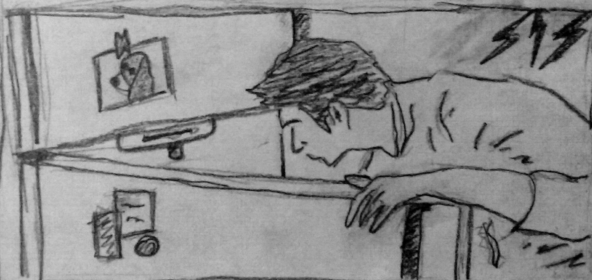

--- 
title: "A Conditional Dinner"
author: "A. Lucas"
date: "`r Sys.Date()`"
site: bookdown::bookdown_site
documentclass: book
bibliography: [book.bib, packages.bib]
biblio-style: apalike
link-citations: yes
description: "This is a minimal example of using the bookdown package to write a book. The output format for this example is bookdown::gitbook."
---
# {.unnumbered .unlisted}
```{r my-fig, out.width='50%', echo=FALSE, fig.align='left'}

```

